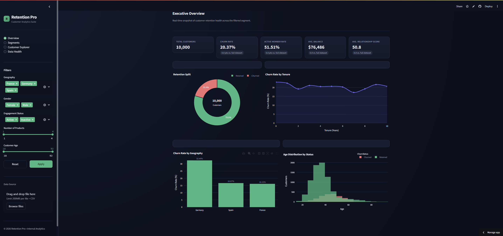
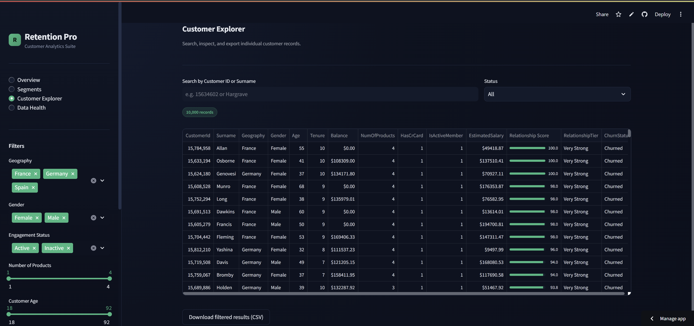
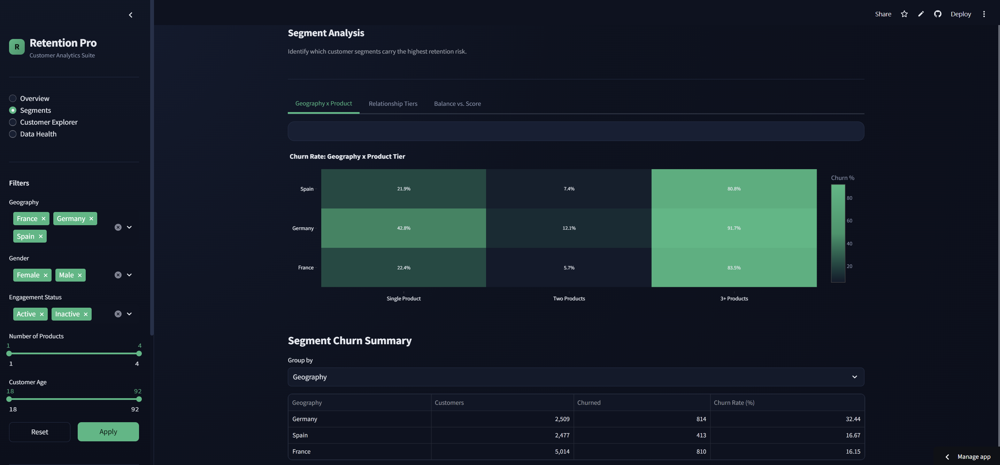
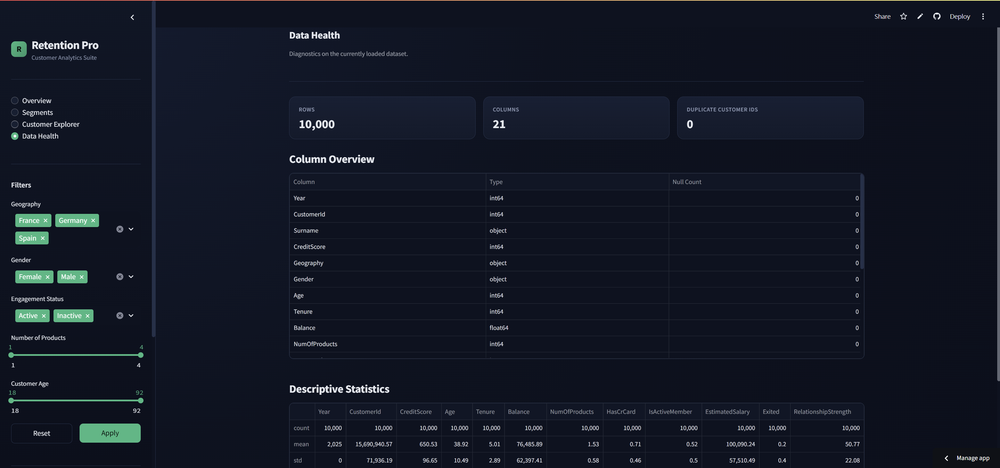

<div align="center">

# 📊 Customer Retention Analytics Pro

**Enterprise-grade customer churn & retention intelligence platform**

Behavioral engagement analytics for data-driven retention strategy


**© 2026 Yuvraj Singh · All Rights Reserved**

</div>

---

## Table of Contents

- [Overview](#overview)
- [Features](#features)
- [Project Structure](#project-structure)
- [Installation](#installation)
- [Usage](#usage)
- [Deployment](#deployment)
- [Data](#data)
- [Ownership & License](#ownership--license)
- [Disclaimer](#disclaimer)
- [Contact](#contact)

---

## Overview

**Customer Retention Analytics Pro** is a full-stack Streamlit application that transforms raw banking customer data into actionable retention intelligence. Rather than relying on demographics or financial strength alone, the platform evaluates churn through the lens of **engagement**, **product utilization**, and **relationship depth** — surfacing the customers, segments, and behaviors that matter most.

---

## Features

| Module | Description |
|---|---|
| 📈 **Executive Overview** | Headline KPIs (churn rate, active-member share, product mix) with delta indicators |
| 🧩 **Segment Analysis** | Churn cross-cuts by geography, age band, balance tier, and product count |
| 🔍 **Customer Explorer** | Searchable, sortable, exportable customer-level record table |
| 🩺 **Data Health** | Automated dataset diagnostics and data-quality summary |
| 🎨 **Custom Theming** | Corporate dark-mode UI via `.streamlit/config.toml` |
| ⚡ **Performance** | `@st.cache_data` / `@st.cache_resource` for instant reruns |

---

## Project Structure

```
customer_retention_analytics_pro/
├── app.py                  # Application entry point
├── requirements.txt        # Pinned pip dependencies
├── README.md                # Documentation (this file)
├── .streamlit/
│   └── config.toml          # Theme & layout configuration
├── data/
│   └── European_Bank.csv    # Bundled sample dataset
├── components/               # Modular UI components (sidebar, charts, pages)
└── utils/                    # Data loading, validation, and metrics logic
```

---

## Installation

```bash
# 1. Extract the archive and move into the project folder
cd customer_retention_analytics_pro

# 2. Install dependencies
pip install -r requirements.txt
```

## Usage

```bash
streamlit run app.py
```

The app launches at **http://localhost:8501**. If your browser doesn't open automatically, navigate there manually.

---

## Deployment

Deploy a public instance in minutes with **Streamlit Community Cloud**:

1. Push this project to a GitHub repository owned or authorized by Yuvraj Singh.
2. Visit [share.streamlit.io](https://share.streamlit.io) and connect the repository.
3. Set the entry point to `app.py` and deploy.
4. Receive a live `*.streamlit.app` URL.

---

## Data

The bundled dataset (`data/European_Bank.csv`) is provided for demonstration. Swap in your own CSV with a matching schema, or upload a file directly within the app's UI.

---

## 📸 Project Screenshots

The following screenshots demonstrate the major modules and interactive features of the Customer Retention Intelligence dashboard.

### Executive Dashboard

The Executive Dashboard provides a high-level overview of customer retention, churn indicators, key performance metrics, and business insights.



### Customer Explorer

The Customer Explorer allows users to examine customer-level information and explore the underlying dataset interactively.



### Segment Analysis

The Segment Analysis module provides insights into different customer segments and helps identify patterns in customer behaviour and retention.



### Data Health

The Data Health module provides an overview of dataset quality, missing values, data consistency, and other data-quality indicators.


## Ownership & License

**Owner:** Yuvraj Singh
All rights, title, and interest in this software — including source code, documentation, and design assets — are owned exclusively by Yuvraj Singh.

**License: All Rights Reserved.**
No part of this repository may be copied, modified, distributed, sublicensed, publicly displayed, reverse-engineered, or used in any form — commercial or non-commercial — without prior express written permission from the owner. Unauthorized use may result in legal action.

---

## Disclaimer

This software is provided "as is," without warranty of any kind. The owner assumes no liability for damages or losses arising from its use.

---

## Contact

**Yuvraj Singh** — Owner & Author
For licensing or permission requests, please reach out directly.

<div align="center">

*Built with Streamlit · Maintained by Yuvraj Singh*

</div>
